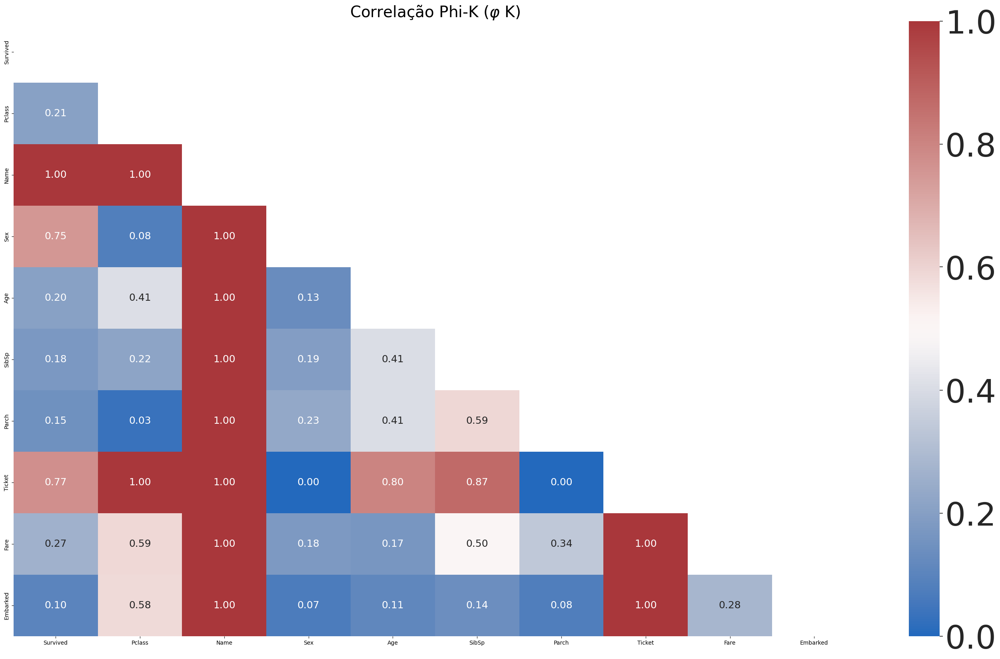
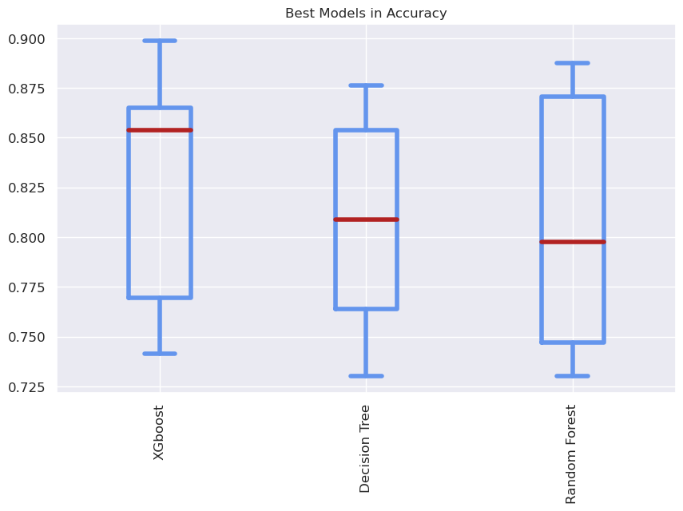

# titanic_auto_ml
Desenvolvido por:
[Marcelo Passamai Mendes](https://www.linkedin.com/in/marcelo-mendes/)  
Na Disciplina de Aprendizado de Máquina em 2022

## Importando bibliotecas


```python
!pip install phik > /dev/null & echo 'Library Phi K Installed'
!pip install xgboost > /dev/null & echo 'Library XGBoost Installed'
```

    Library Phi K Installed
    Library XGBoost Installed


```python
import pandas as pd
import numpy as np

from sklearn.model_selection import train_test_split
from sklearn.pipeline import Pipeline
from sklearn.impute import SimpleImputer
from sklearn.preprocessing import OneHotEncoder
from sklearn.compose import ColumnTransformer

from sklearn.model_selection import cross_validate
from sklearn.model_selection import GridSearchCV
import phik
import matplotlib.pyplot as plt
import phik
import seaborn as sns
from sklearn.tree import DecisionTreeClassifier
from sklearn.ensemble import RandomForestClassifier
from xgboost import XGBClassifier
```

### Fazendo carga da base de dados


```python
df =  pd.read_csv('titanic.csv',index_col = 0)
```

## Análise de dados

### Verificação de nulos


```python
df.isnull().mean().sort_values(ascending=False)*100
```


    Cabin       77.104377
    Age         19.865320
    Embarked     0.224467
    Survived     0.000000
    Pclass       0.000000
    Name         0.000000
    Sex          0.000000
    SibSp        0.000000
    Parch        0.000000
    Ticket       0.000000
    Fare         0.000000
    dtype: float64


A coluna  Cabin tem um indice alto de nulos por esse motivo será removida.


```python
df = df.drop('Cabin', axis = 1)
```

### Verificando multicolineariedade


```python
df_phik = df.phik_matrix()
```

    interval columns not set, guessing: ['Survived', 'Pclass', 'Age', 'SibSp', 'Parch', 'Fare']


```python
plt.figure(figsize=(34,20))
plt.title(r'Correlação Phi-K ($\varphi$ K)', fontsize=28)

# Construção de uma máscara
# Usando Booleanos pois o phi k vai de 0 a 1
# Com inteiros deu problema
mask = np.triu(np.ones_like(df_phik, dtype = bool))
sns.set(font_scale=1.5)
htm = sns.heatmap(df_phik, annot=True, mask = mask,
                  vmin=0, vmax=1, cmap='vlag',fmt='.2f',)

cbar = htm.collections[0].colorbar
cbar.ax.tick_params(labelsize = 58)

plt.savefig('triu.pdf')
plt.show()
```


    

    


Podemos observar que as colunas 'Ticket' e 'Name' tem uma correlção alta com muitas características por esse motivo vamos remover.  
Sendo asism prejudicando a variabilidade dos dados.


```python
# retirando colunas com nome, ingresso e cabine dos conjuntos
df.drop(["Name", "Ticket"] , axis=1, inplace=True)# Fare
```


```python
df['Sex'].value_counts()
```


    male      577
    female    314
    Name: Sex, dtype: int64


## Pipeline


```python
# pipeline para pré-processamento das variáveis Age e Fare
num_transformer = Pipeline(steps=[
    ('imputer', SimpleImputer(strategy='median'))
])
```


```python
# pipeline para pré-processamento das variáveis Sex e Embarked
cat_transformer = Pipeline(steps=[
    ('one-hot encoder', OneHotEncoder())
])
```


```python
# Compondo os pré-processadores
preprocessor = ColumnTransformer(transformers=[
    ('num', num_transformer, ['Age', 'Fare']),
    ('cat', cat_transformer, ['Sex', 'Embarked'])
])
```


```python
# Lista de métricas Para classificação
from sklearn.metrics import roc_auc_score
from sklearn.metrics import accuracy_score
from sklearn.metrics import f1_score
metric = []
```


```python
# Decision tree
param_dt = {'criterion':['gini', 'entropy', 'log_loss'],
           'max_depth':[2,3,4,5,7],}

# Random Forest
params_rf = {'n_estimators':[100,150,200,250,300,700],
             'max_depth':[2,3,4,5,6,7,],
             'criterion':['gini', 'entropy', 'log_loss'],}

# XGBoost
params_xgb = {'n_estimators':[100,150,200,250,300],
             'max_depth':[2,3,4,5,6,7],
             'eta':[0.1,0.2,0.3,0.4,],}


models = [ (DecisionTreeClassifier(), param_dt, 'Decision Tree'),
           (RandomForestClassifier(), params_rf, 'Random Forest'),
           (XGBClassifier(),params_xgb,'XGboost')]

```


```python
X = df.drop(['Survived'],axis=1)
y = df['Survived']           
X_train, X_test,\
y_train, y_test = train_test_split(X, y,\
                  train_size = 0.7, random_state = 42)
cv = 7
```


```python
df_result = pd.DataFrame()
classifier_list = []
for model_ in models:
    grid = GridSearchCV(model_[0], param_grid = model_[1], cv = cv,\
                        n_jobs = -1, scoring = 'accuracy')
    
    pipe =  Pipeline(steps=[
        ('preprocessor', preprocessor),
        (model_[2], grid)
    ])

    # treinando mo modelo
    pipe.fit(X_train,y_train)
    
    # Salvando resultados
    index = pipe[model_[2]].best_index_
    cv_results = pipe[model_[2]].cv_results_
    df_result[model_[2]] = [cv_results[f"split{i}_test_score"][index] for i in range(cv)]
    
    # Salvo para acessar o modelo desejado
    # criado pelo pipeline em caso de uso
    # em produção ou para uso de explicabilidade como o shap
    #classifier_list['Decision Tree'].best_estimator_
    #classifier_list.predict(X_test)
    classifier_list.append(pipe)
    
        
```


```python
df_result
```


<table border="1" class="dataframe">
  <thead>
    <tr style="text-align: right;">
      <th></th>
      <th>Decision Tree</th>
      <th>Random Forest</th>
      <th>XGboost</th>
    </tr>
  </thead>
  <tbody>
    <tr>
      <th>0</th>
      <td>0.730337</td>
      <td>0.741573</td>
      <td>0.741573</td>
    </tr>
    <tr>
      <th>1</th>
      <td>0.876404</td>
      <td>0.876404</td>
      <td>0.876404</td>
    </tr>
    <tr>
      <th>2</th>
      <td>0.842697</td>
      <td>0.865169</td>
      <td>0.853933</td>
    </tr>
    <tr>
      <th>3</th>
      <td>0.741573</td>
      <td>0.730337</td>
      <td>0.741573</td>
    </tr>
    <tr>
      <th>4</th>
      <td>0.786517</td>
      <td>0.797753</td>
      <td>0.853933</td>
    </tr>
    <tr>
      <th>5</th>
      <td>0.808989</td>
      <td>0.752809</td>
      <td>0.797753</td>
    </tr>
    <tr>
      <th>6</th>
      <td>0.865169</td>
      <td>0.887640</td>
      <td>0.898876</td>
    </tr>
  </tbody>
</table>


```python
def boxplot_sorted(df, score, title, rot=90, figsize=(10,6), fontsize=12):
    df2 = df
    meds = df2.median().sort_values(ascending=False)
    axes = df2[meds.index].boxplot(figsize=figsize, rot=rot, fontsize=fontsize,
                                   boxprops=dict(linewidth=4, color='cornflowerblue'),
                                   whiskerprops=dict(linewidth=4, color='cornflowerblue'),
                                   medianprops=dict(linewidth=4, color='firebrick'),
                                   capprops=dict(linewidth=4, color='cornflowerblue'),
                                   flierprops=dict(marker='o', markerfacecolor='dimgray',
                                        markersize=12, markeredgecolor='black'),
                                   return_type="axes")
    axes.set_title(title, fontsize=fontsize)
    plt.savefig(title + '.pdf')
    plt.show()
```


```python
boxplot_sorted(df_result,'accuracy', 'Best Models in Accuracy')
```


    

    


```python
for i in range(len(models)):
    print(models[i][2])
    print(classifier_list[i][models[i][2]].best_params_)

```

    Decision Tree
    {'criterion': 'entropy', 'max_depth': 7}
    Random Forest
    {'criterion': 'gini', 'max_depth': 5, 'n_estimators': 200}
    XGboost
    {'eta': 0.1, 'max_depth': 4, 'n_estimators': 200}

